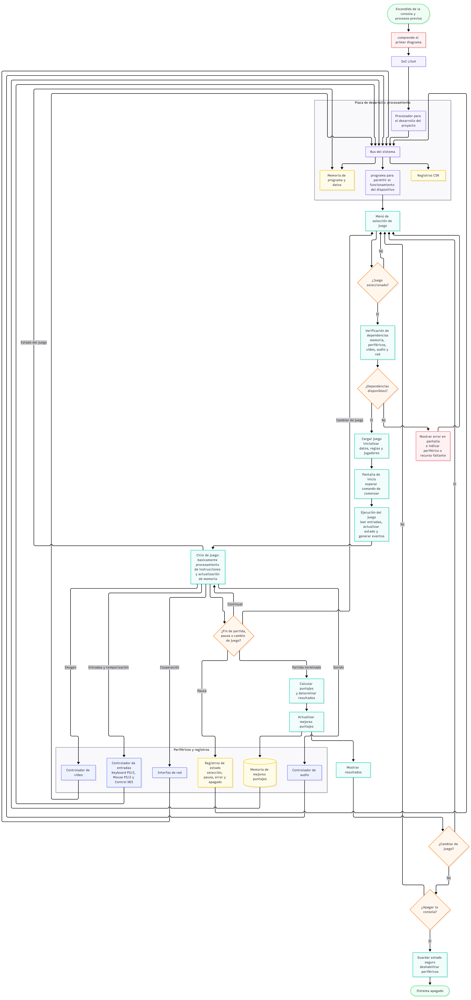

Entrega: DIAGRAMA DE BLOQUES PARA ENTENDIMIENTO DE LOGICA EN EL PROYECTO.

Este primer diagrama presenta una vista de alto nivel de la "caja de videojuegos": desde la alimentación del sistema hasta las salidas de audio y video, pasando por la placa de desarrollo, los periféricos de entrada disponibles para el jugador, entre otros. El objetivo es que cualquier persona del equipo (o externa al proyecto) entienda, de un vistazo, qué componentes existen, además de cómo se relacionan entre sí, antes de entrar en el detalle de cómo funciona cada uno internamente.

Por ahora, el bloque "Placa de desarrollo" se representa como una caja única; será para ese nivel de abstracción como nuestra "caja negra". Esa decisión es intencional: a este nivel no es necesario mostrar el procesador, el bus de comunicación ni los periféricos individuales que viven dentro de la FPGA; eso corresponde a un segundo diagrama, más profundo y menos general, que documentará el proceso que comprende desde la selección efectiva del juego hasta el "gameplay" proporcionado por el sujeto, cómo la placa de desarrollo lee esto, incluido el procesamiento de controles, terminación del juego y, finalmente, la vuelta a empezar.

Para esta sección, entonces, se vio cómo funciona, de una manera más direccionada a lo particular, no tan general, del funcionamiento por dentro del proyecto. El esquema ayudó a entender realmente la lógica detrás de todo, errores que se tenían previamente vistos a manera de conceptos y cómo todo debe tener de cierta manera una "vuelta" o protocolo para los errores que puedan aparecer. También, tomando en cuenta los que pueda cometer el propio usuario. Además, se introdujo el concepto de "buses CSR". Externo a lo textual puesto en el diagrama, pero aplicado, esto define "Control and Status Registers"; en otras palabras, data de, básicamente, cómo se toma un canal de comunicación entre el procesador y los periféricos, además de comprobaciones varias del estado del programa. Como no se tiene un nivel de rigurosidad tan profundo, solo se va a tomar de referencia el diagrama dado por el profesor en el repositorio oficial del curso sobre el procesador junto con los controladores asociados a este. Próximamente, entonces, se profundizará y realizará otro diagrama con esa rigurosidad cuando se requiera, teniendo como base más importante la realización de este desde el no desconocimiento. 

